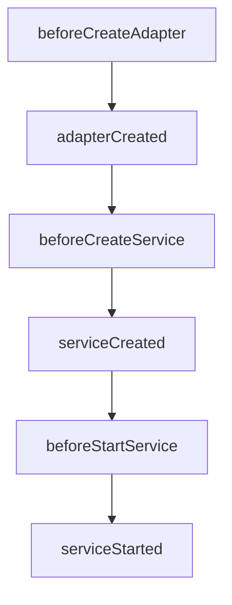

# Custom Adapter template for NBC

This repository has templates for creating the custom adapter for Nodeblocks Service for Nodeblocks Cloud (NBC).
The custom adapters allow us to extend the functionality of the Nodeblocks Service.

## Create a repository for the custom adapter

First, create a new repository on GitHub for the custom adapter and place the necessary files below.

```bash
.
├── package.json
├── package-lock.json
├── nbc.adapter.json   # The custom adapter manifest used to define the adapter configs on the NBC dashboard
└── src
    └── index.js       # The main entry point of the custom adapter
```

You need to provide the `name` and `main` fields in `package.json` at least so that NBC can recognize the custom adapter as an npm package.

```json
{
  "name": "auth-custom-adapter",
  "main": "src/index.js",
}
```

## How to customize the adapter

You can customize the behavior of the default adapter by using NBC service lifecycle hooks.
In the entry file (index.js), you can define the following functions as needed.

- `beforeCreateAdapter`: Called before the adapter is created. This hook can be used to customize the adapter configs.
- `adapterCreated`: Called after the adapter is created. This hook can be used to customize the adapter instance.
- `beforeCreateService`: Called before the service is created. This hook can be used to customize the service configs.
- `serviceCreated`: Called after the service is created. This hook can be used to perform any post service creation tasks.
- `beforeStartService`: Called before the service is started. This hook can be used to customize the options for starting the service.
- `serviceStarted`: Called after the service is started. This hook can be used to perform any post service starting tasks.



## How to add additional adapter configs

You can add additional configs for the custom adapter in `nbc.adapter.json`.
Type of config value can be one of the following:

- string
- number
- boolean
- regexp
- multiline
- json
- commaSeparatedList
- select

```json
{
  "schema": "1.0.0",    // It must be "1.0.0"
  "type": "adapter",    // It must be "adapter"
  "version": "1.0.0",   // It must be "1.0.0"
  "configs": [
    {
      "displayName": "String config value",
      "description": "The example of String type config value.",
      "type": "string",
      "name": "ADAPTER_CUSTOM_STRING", // It must start with "ADAPTER_CUSTOM_"
      "required": false,
      "defaultValue": "test"
    },
    ...
  ]
}
```

If you don't need any additional configs, you can leave the `configs` field empty.

```json
{
  "schema": "1.0.0",
  "type": "adapter",
  "version": "1.0.0",
  "configs": []
}
```


## How to access the adapter configs in the custom adapter

You can access the adapter configs through the `process.env` object in the custom adapter code.

```javascript
const foo = process.env.ADAPTER_CUSTOM_FOO;
```

## Use TypeScript in the custom adapter

You can use TypeScript in the custom adapter.
Copy the template folder for each service and modify the code as needed.
You need to add `build` script in the `package.json` to build the TypeScript code.

```json
{
  "scripts": {
    "build": "tsc"
  }
}
```

## How to develop the custom adapter locally while previewing the changes

Run the dev server by Nodeblocks CLI to develop the custom adapter locally.
At this first time you run the dev server, the CLI asks you to update the `.env.<service>` file.
The file is inside the working directory.

```bash
# Run nbc adapter dev
npm run dev
```
