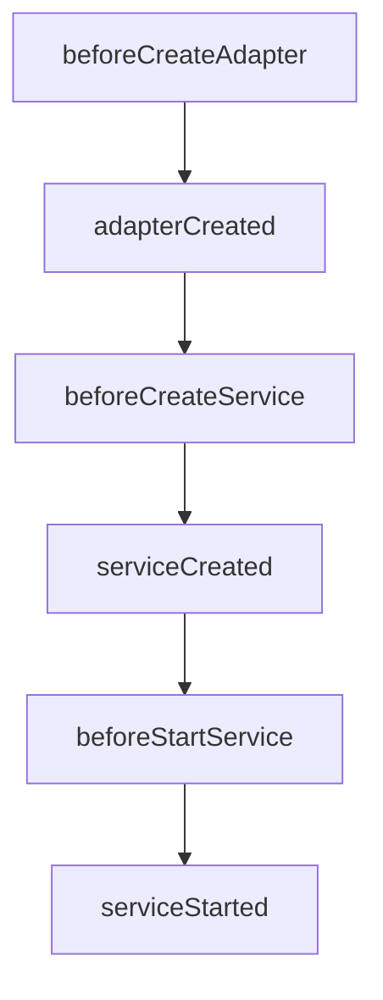

# Custom Adapter template for NBC

This repository has templates for creating the custom adapter for Nodeblocks Service for Nodeblocks Cloud (NBC).
The custom adapters allow us to extend the functionality of the Nodeblocks Service.

## ▶ Setup

### Prerequisites

You will need to have Node.js and npm correctly set up.

### Create a repository for the custom adapter

First, create a new repository in GitHub for the custom adapter and place the necessary files below. 
It is recommended that you copy the files from the desired service template folder.

```bash
.
└── src
    └── index.js       # The main entry point of the custom adapter
├── .npmrc
├── nbc.adapter.json   # The custom adapter manifest used to define the adapter configs on the NBC dashboard
├── package-lock.json
├── package.json

```

Create a `.env` file and add your `BASALDEV_AUTH_TOKEN`.
We also suggest using `.gitignore`.


You need to provide the `name` and `main` fields in `package.json` at least so that NBC can recognize the custom adapter as an npm package.

e.g:
```json
{
  "name": "auth-custom-adapter",
  "main": "src/index.js",
}
```

*Note: You need to use the package manager **npm*** 

### Use TypeScript in the custom adapter

You can use TypeScript in the custom adapter.
Copy the template folder for each service and modify the code as needed.
In addition to the above (replace `src/index.js` with `src/index.ts`), you will also need:

```bash
.
├── tsconfig.json

```

Your working directory should now look like this:

```bash
.
└── src
    └── index.ts       # The main entry point of the custom adapter
├── .env
├── .gitignore
├── .npmrc
├── nbc.adapter.json   # The custom adapter manifest used to define the adapter configs on the NBC dashboard
├── package-lock.json
├── package.json
├── tsconfig.json

```


You need the `build` script in the `package.json` to build the TypeScript code.

```json
{
  "scripts": {
    "build": "tsc"
  }
}
```

You also need to confirm the `name` in `package.json` aligns with the build destination (`"outDir"`) in `tsconfig.json`.
```json 
{  
  "main": "dist/index.js" 
} 
``` 

### How to develop the custom adapter locally while previewing the changes 

Run `npm install`.

Run the dev server by Nodeblocks Cloud SDK to develop the custom adapter locally.
At the first time you run the dev server, the CLI asks you to create the `.env.<service>` and `nbc.sdk.json` files.
These files are inside the working directory. Update the values in `.env.<service>` accordingly. 
Now when you run the command, it will actually start the dev server.

```bash
# Run nbc adapter dev
npm run dev
```

If you make changes to the configs in `nbc.adapter.json`, please also add them to `.env.<service>`.

Your working directory should now look like this, and you are ready to begin customizing your adapter.

```bash
.
└── node_modules
    └── ...
└── src
    └── index.ts       # The main entry point of the custom adapter
├── .env
├── .env.<service>
├── .gitignore
├── .npmrc
├── nbc.adapter.json   # The custom adapter manifest used to define the adapter configs on the NBC dashboard
├── nbc.sdk.json
├── package-lock.json
├── package.json
├── tsconfig.json

```


## ▶ Customization

### How to customize the adapter

You can customize the behavior of the default adapter by using NBC service lifecycle hooks.
In the main file to be built (index.ts), you can define the following functions as needed. (If using js, this will be your index.js entry file instead.)

- `beforeCreateAdapter`: Called before the adapter is created. This hook can be used to customize the adapter configs.
- `adapterCreated`: Called after the adapter is created. This hook can be used to customize the adapter instance.
- `beforeCreateService`: Called before the service is created. This hook can be used to customize the service configs.
- `serviceCreated`: Called after the service is created. This hook can be used to perform any post service creation tasks.
- `beforeStartService`: Called before the service is started. This hook can be used to customize the options for starting the service.
- `serviceStarted`: Called after the service is started. This hook can be used to perform any post service starting tasks.



For more specific guidance on lifecycle hooks, please refer to the `./<service>/src/index.ts` file of this template repo.

### How to add additional adapter configs

You can add additional configs for the custom adapter in `nbc.adapter.json`.
The config values defined in this file are supposed to be shown on the NBC dashboard, under the service configs.


Type of the config value can be one of the following:

- string
- number
- boolean
- regexp
- multiline
- json
- commaSeparatedList
- select

```json
{
  "schema": "1.0.0",    // It must be "1.0.0"
  "type": "adapter",    // It must be "adapter"
  "version": "1.0.0",   // It must be "1.0.0"
  "configs": [
    {
      "displayName": "String config value",
      "description": "The example of String type config value.",
      "type": "string",
      "name": "ADAPTER_CUSTOM_STRING", // It must start with "ADAPTER_CUSTOM_"
      "required": false,
      "defaultValue": "test"
    },
    ...
  ]
}
```

You need to have this file even though you don't need any additional configs. In that case, you can leave the `configs` field an empty array.

```json
{
  "schema": "1.0.0",
  "type": "adapter",
  "version": "1.0.0",
  "configs": []
}
```


### How to access the adapter configs in the custom adapter

You can access the adapter configs through the `process.env` object in the custom adapter code.

```javascript
const foo = process.env.ADAPTER_CUSTOM_FOO;
```

### Deploy

Once you are happy with your custom adapter, on the NBC editor page, update the adapter setting to 'custom' for your chosen service, then update any necessary configs and re-deploy.